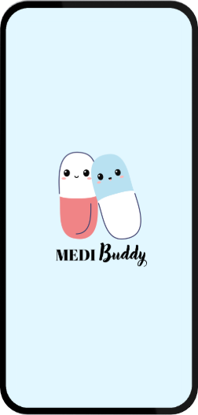
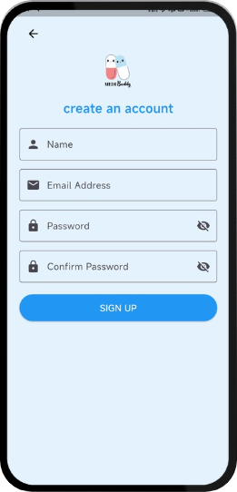
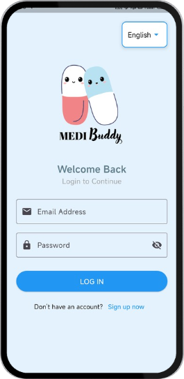
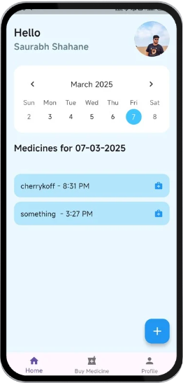
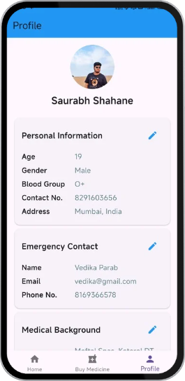

# 🌟 MediBuddy - Medication Management App


## 📌 Project Description
MediBuddy is a **medication reminder app** designed to help users:
- 📅 **Schedule medicines** effortlessly
- 🔔 **Receive reminders** to never miss a dose
- 🏥 **Locate nearby pharmacies** for easy access
- 👨‍⚕️ **Notify caregivers** about missed doses

With a **user-friendly interface** and **multi-language support**, MediBuddy improves **medical adherence**, especially for elderly users.

---

## 📸 Screenshots  
    
    

*(Screenshots of the app interface)*

---

## 🚀 Features
✔️ **Schedule medicines** – Set up daily reminders for medications.  
✔️ **Receive reminders** – Get timely notifications.  
✔️ **Locate nearby pharmacies** – Find pharmacies with ease.  
✔️ **Notify caregivers** – Alert caregivers when a dose is missed.  
✔️ **Simple UI** – Designed for easy use, especially by elderly users.  
✔️ **Multi-language support** – Uses Flutter localization for accessibility.  
✔️ **Emergency contacts** – Save and access emergency contacts.  
✔️ **Medical history tracking** – Maintain a complete medication history.  

---

## 🛠 Tech Stack
🔹 **Frontend:** Flutter (Dart)  
🔹 **Backend:** Supabase  
🔹 **Database:** Supabase  

---

## 🔧 Installation & Setup
### 🛑 Prerequisites
- Install [Flutter](https://flutter.dev/docs/get-started/install)
- Set up an emulator or use a physical device

### 🛠 Steps to Run the Project
1. **Clone the repository**
   ```bash
   git clone https://github.com/your-username/MediBuddy.git
   cd MediBuddy
   ```  
2. **Install dependencies**  
   ```bash
   flutter pub get
   ```  
3. **Run the app**  
   ```bash
   flutter run
   ```  

---

## 📞 Contact / Acknowledgments  
📌 Developed by **Team JR-19 Code Chefs**  
👨‍💻 **Vedika Parab, Aarya Gharmalkar, Saurabh Shahane, Nishad Shirodkar**  
📧 Contact: 2023.vedika.parab@ves.ac.in  

---

🚀 *Let's build a healthier tomorrow with MediBuddy!*
